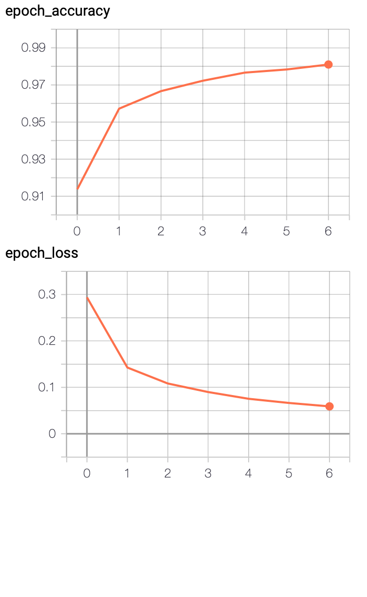
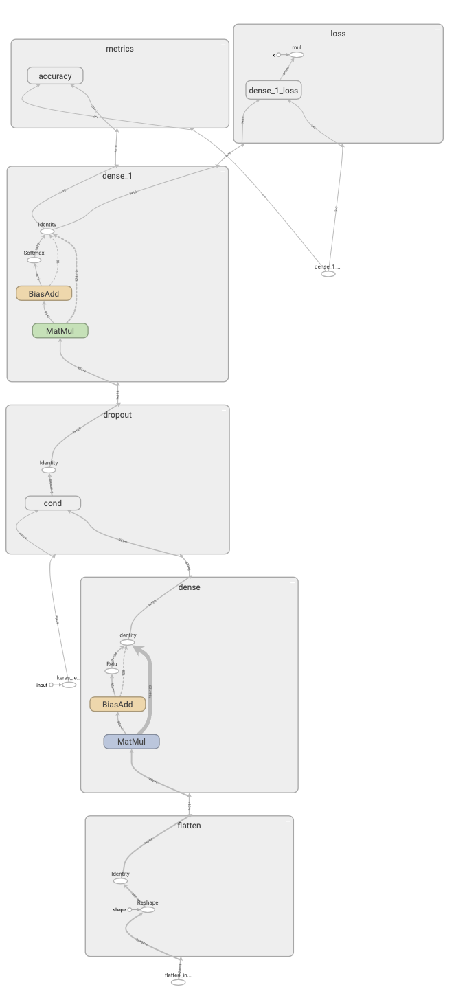

# Number Recognition Neural Network

Basic handwritten number recognition (Python3, tensorflow + keras, MNIST dataset).

This program uses tensorflow.keras to identify handwritten numbers using a sequential neural network with 3 layers. On the right you can see an example for the accuracy and loss that is achieved after seven epochs.

	
Below is a visual representation of the network created using TensorBoard. If you want to create such a graph yourself just run the program.

